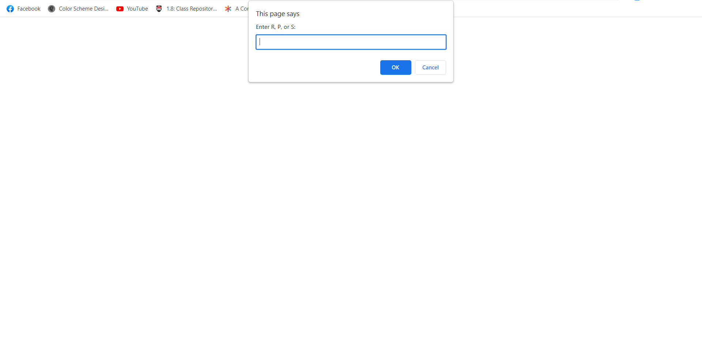

# Rock, Paper, Scissors

## Mini-Project: Javascript Intro - Module 3

### Description

A game of rock, paper, scissors using only javascript against the computer.

## User Story

As a user, I want to play Rock, Paper, Scissors against an automated opponent. 
As a user, I can enter R, P, or S to signify my choice of rock, paper, or scissors. 
As a user, I expect the computer to choose R, P, or S in return. 
As a user, I want the option to play again whether I win or lose. 
As a user, I want to see my total wins, ties, and losses after each round. 

### Acceptance Criteria

Must use the `alert()`, `confirm()`, and `prompt()` methods to collect user input and display information to the user. 
The computer's selection must be random to ensure a fair game. 
